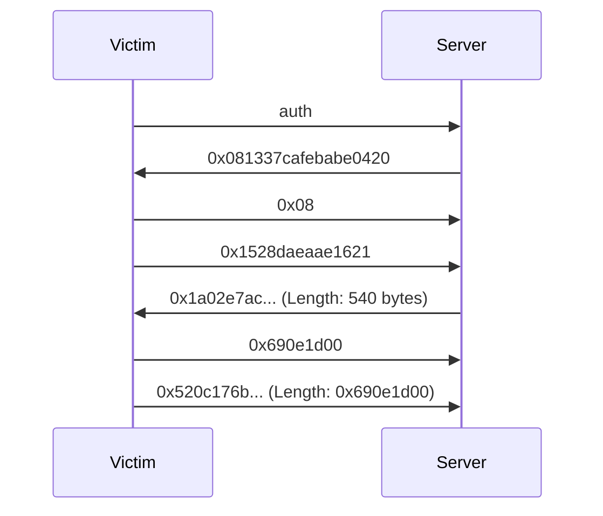

# Free license generator

> by Lxt3h and mhoste

This was the harddest reverse engineering challenge from HTB business CTF. This chall helped us to improve our skills on the Win API and miasm.

They give us a pcap and a x86 PE binary wich is a malware. The pcpap is the communication between the victim and the C2.

## pcap analysis

This is what it looks like : 


Here is a diagram about the communication : 



First, the victim send "auth" to authenticate with the C2, the C2 respond with a possible key, then the victim send an other key, it looks like the encrypted first key, with his length.
Secondly, the server respond with a lot of bytes (potentially encrypted data).
Finally, the victim send a lot of data which looks like encrypted data exfiltrated from the malware with his length.

## Static analysis of PE


We see "UPX compressed", so we need to unpack it with UPX -d.

> note: UPX version <= 3.96 has some problems with rva relocation on PE unpacking, so you need to update it with the latest version.

Let's now open it with IDA 


This PE is using api hashing, so we will analyse it dynamically to get the functions name.

## Dynamic analysis

The first function execute a Virtual Alloc, and print some strings.

The second one : 

As we can see, it will just create a Thread.

The third one is more interesting, it calls 3 functions : 

### NtSetInformationThread

By reading the doc, we know that, it will collect some information about a thread. It will set 0x11 to ThreadInformationClass and it corrsepond to this:
 ```
ThreadInfoClass = (
                        ThreadBasicInformation,
                        ThreadTimes,
                        ThreadPriority,
                        ThreadBasePriority,
                        ThreadAffinityMask,
                        ThreadImpersonationToken,
                        ThreadDescriptorTableEntry,
                        ThreadEnableAlignmentFaultFixup,
                        ThreadEventPair_Reusable,
                        ThreadQuerySetWin32StartAddress,
                        ThreadZeroTlsCell,
                        ThreadPerformanceCount,
               ...
                        ThreadIsIoPending,
                        ThreadHideFromDebugger, {<--}
                        ThreadBreakOnTermination,
                        ThreadSwitchLegacyState,
                        ...
                        ThreadSuspendCount,
                        ThreadActualGroupAffinity,
                        ThreadDynamicCodePolicyInfo,
                        MaxThreadInfoClass
  );
```

ThreadHideFromDebugger is a flag to delete exceptions SEH of the debugger on thread past in argument. So in our case, the function takes in argument the handle of CreateThread and set HideFromDebuger to make the debugger crash on this thread.

This anti-debug technical will block us to debug the next thread. The solution is to bypass it by patching the function NtSetInformationThread to debug.

The next 2 functions (ResumeThread and WaitForSingleObject) will start the new thread with anti debug. 
After patching the first function, we get into the thread correctly : 


Now we extract the shellcode to analyse it with miasm.

# Miasm analysis
After analysing the shellcode with miasm we know : 
The shellcode will receive a key from the C2, encrypt it and after that, send it to the C2. This key will allow us to decipher the new shellcode send by the C2. We juste have to emulate the execution of this malare in miasm, and set all the values that we received from the C2

Because of the size of our script, we will comment all important lines : 
```py
from pdb import pm
from miasm.jitter.csts import PAGE_READ, PAGE_WRITE
from miasm.analysis.sandbox import Sandbox_Win_x86_32
from miasm.core.locationdb import LocationDB
from miasm.os_dep.common import get_win_str_a, get_win_str_w
import os, time, sys, crcmod

# Parse arguments
parser = Sandbox_Win_x86_32.parser(description="PE sandboxer")
parser.add_argument("filename", help="PE Filename")
parser.add_argument("shellcode", help="Shellcode file")
options = parser.parse_args()

# Emulate NtAllocateVirtualMemory, it just need a return of 0
def NtAllocateVirtualMemory(jitter):
  jitter.cpu.EAX = 0

# Emulate the connection with the C2
def ws2_32_connect(jitter):
  jitter.cpu.EAX = 0

# Emulate the receive function 
def ws2_32_recv(jitter):
  jitter.cpu.EAX = 1
  print("recv")

# Emulate the seconde receive wich is the size of the next receive
def recv1(jitter):
  jitter.cpu.EAX = 8
  print("recv1")
  return True

# 3rd receive which is the key send by the C2
def recv2(jitter):
  jitter.vm.set_mem(jitter.cpu.EDX, b"\x13\x37\xCA\xFE\xBA\xBE\x04\x20")
  print("recv2")
  return True

#Receive the length of the next shellcode that the C2 will send
def recv3(jitter):
  jitter.cpu.EAX = 538
  print("recv3")
  return True

# Receive the shellcode
def recvshellcode(jitter):
  jitter.vm.set_mem(jitter.cpu.EDX, b"\xe7\xac\xbf\x87\xc2\xd1\xb4\x0a\x9e\x40\xbf\x86\xc2\xb5\xd2\x7f\x66\x40\xbf\x0d\x82\xdd\xf8\x0f\x72\xcb\xff\x96\x4b\x94\x83\xc4\x2e\x7c\x34\xca\xca\xa9\x72\x8e\xef\x0d\x53\x0d\x9b\xf1\x72\x8c\xef\x81\x8e\x79\x49\xe5\xc8\x4e\xa8\x71\x6d\xb7\x02\x7d\x72\x8d\x5a\x40\xca\x7f\x43\x2b\x82\x46\x66\x40\xcb\x85\x85\x3a\x96\xc4\x23\xb0\x34\xf3\x2e\x5a\x05\x6b\x67\x86\xb0\x31\xf6\xaf\xf8\x02\x8a\xcb\xf6\x9a\xc3\x10\xf8\x7b\xd7\x41\x79\x0f\x2b\x52\x9a\x6f\x37\xc9\x56\x05\x2b\xf5\x22\xb0\xb0\xf8\x99\xe0\xad\xad\x23\xf7\x6c\x76\x86\xe3\x92\x69\x15\x6e\x47\x6c\xef\x3e\xa4\xdb\x56\x68\x36\xf8\x9f\x8c\xa3\xf6\x23\xf7\x47\x4a\x93\xe3\x92\x69\x5f\x45\x51\x60\xef\x3e\xc8\xb7\x12\x69\x36\xf8\x9e\xbb\xa3\xf0\x23\xf7\x5d\x25\x9e\x8c\x92\x69\x17\x6e\x06\x4a\xef\x3f\xc2\xd1\x73\x4f\xdc\x6c\xbf\x86\xc2\x51\x47\x43\x33\xc3\x7e\x87\xfb\x00\x06\xba\xef\x25\x6f\xec\xee\x58\x16\x83\xa1\x05\x7f\x86\xc2\xd1\x73\x88\x23\xfc\xbf\x86\xc2\xd1\xb4\x0a\xde\x40\xbf\x86\xc2\x5a\x0e\x93\xef\xae\x3c\x68\x86\x5a\x3e\xaf\xdd\x40\xbf\x86\xc2\x58\xab\x7e\xb4\x11\x06\x8e\xc2\xd1\x73\xb8\x97\x19\x36\x56\xc3\x21\xf9\x4f\xef\xba\xbe\x5c\x48\xc3\x43\x9f\xef\xba\xbe\x5c\x4a\xd3\x30\x76\xad\x34\xbd\x6d\x1a\x69\x78\x53\x3d\x4c\xef\x3e\xd8\x89\x6f\x14\x36\xf8\xe6\x9d\xf5\xc9\x23\xf7\x7e\x77\xa3\x86\x92\x69\x44\x4c\x3d\x1b\xef\x3e\xd8\x8a\x77\x5e\x36\xf8\xbb\xb1\xd9\xcc\x23\xf7\x51\x5f\xe6\x82\x92\x69\x6f\x4f\x3f\x5b\xef\x3f\xc2\xd1\x73\x4f\xdc\x64\xbf\x86\xc2\x51\x47\x43\x0e\xc3\x7e\x87\xfb\x00\x06\xba\xef\x25\x3f\xec\xe6\x58\xd6\x33\x99\xbf\x40\x0d\xbf\x0d\xfa\xa1\xe7\xae\x3f\x86\xc2\xd1\xf8\x79\xed\x0d\x5f\x3d\xc2\xd1\x73\x4f\xef\x98\x8e\x54\x93\x68\x57\x4f\x66\x40\x48\x77\x9b\x58\xa3\x4e\x96\xca\xbf\x0f\x38\xd0\xa9\xc5\x74\x40\x6f\x0f\x38\xd0\xa9\xc7\x64\x03\x86\x4d\xb6\xd3\x98\x97\xed\x3d\x63\x0d\xb7\x01\xf8\x02\x86\xfb\xbf\x86\xc2\xd1\xfa\x97\x57\x92\xee\x3f\xee\xd1\x73\x4f\x91\xb1\xe6\x0f\x12\xd0\x83\xc5\x66\xc9\x45\x87\x18\x5b\x61\x7f\xb6\xc9\x45\x87\x18\x59\x71\x0c\x5f\x8b\xcb\x84\x29\x09\x19\x4f\x0c\x44\x36\x6e\x41\x39\x53\x1f\xed\x05\x47\xd6\x49\x84\xcb\xb0\xb4\x2a\xbf\x0d\x87\x31\x23\xc4\x23\x9c\xef\x0d\x87\x29\x23\xc4\x33\xf8\x40\x54\x43\x15\x73\x4e\x66\x40")
  return True

#Emulate the send function
def ws2_32_send(jitter):
  jitter.cpu.EAX = 1
  print("send")

# File descriptor of socket function
def ws2_32_socket(jitter):
  jitter.cpu.EAX = 0x3

# Add the hostname to emulate correctly the program
def ws2_32_gethostbyname(jitter):
  jitter.vm.add_memory_page(0x11111111,PAGE_READ | PAGE_WRITE, b"\x00"*100)
  jitter.vm.set_mem(0x11111111+0x14, b"\x7f\x00\x00\x01")
  jitter.cpu.EAX = 0x11111111
  print(hex(jitter.cpu.EAX))

# implementation of CRC32 because miasm didn't implement it :(
def hashfunc(function, print_hash=True ):
  crc32_func = crcmod.mkCrcFun(0x11EDC6F41, initCrc=0, xorOut=0)
  h = crc32_func((function).encode('utf-8'))
  return h

def code_sentinelleCRC32(jitter):
  if jitter.cpu.ESI > 0:
    jitter.cpu.EDX = hashfunc(chr(jitter.cpu.EAX)+get_win_str_a(jitter, jitter.cpu.ESI, 0x40))
    if jitter.cpu.EDX == 0xB128F4E7 or jitter.cpu.EDX == 0xF3596BDF or jitter.cpu.EDX == 0x95B93110 or jitter.cpu.EDX == 0x6C81586F:
      print(hex(jitter.cpu.EDX),get_win_str_a(jitter, jitter.cpu.ESI, 0x40))
  return True 


def code_sentinelle1(jitter):
  jitter.cpu.EAX = 0x11111111
  return True

# extracting the deciphered shellcode
def saveshellcode(jitter):
  f = open("shellcodeFinal.bin", "wb")
  f.write(jitter.vm.get_mem(jitter.cpu.ECX, 65535))
  f.close()
  print("Extraction done.")
  return True

# Code sentinelle allow us to put breakpoints to debug the shellcode as we want, print some registers etc
def code_sentinelle(jitter):
  #print(jitter.cpu.ECX)
  #print(hex(jitter.cpu.ESI))
  #print(chr(jitter.cpu.EAX))
  #print(jitter.libs.fad2cname[jitter.cpu.EDX])
  #print(hex(jitter.cpu.EAX))
  print(jitter.vm.get_mem(jitter.cpu.ECX, 65535))

  #print(get_win_str_a(jitter, jitter.cpu.ESP + jitter.cpu.ECX, 0x1), end='')
  #print(get_win_str_a(jitter, jitter.cpu.ESI, 0x40), end='')
  #ree-windows-license.uwu
  #hellgen
  #print(get_win_str_a(jitter, 0x40000e8, 40))
  return False


# Create sandbox and emulate PE headers
loc_db = LocationDB()
sb = Sandbox_Win_x86_32(loc_db, options.filename, options, globals())

data = open(options.shellcode,'rb').read()
run_addr  = 0x4000000

#print(sb.jitter.user_globals)
# Add functions to miasm
sb.jitter.user_globals['ws2_32_WSAStartup']= sb.jitter.user_globals['wsock32_WSAStartup']
sb.jitter.user_globals['ntdll_NtAllocateVirtualMemory']= NtAllocateVirtualMemory
sb.jitter.user_globals['ws2_32_socket'] = ws2_32_socket
sb.jitter.user_globals['ws2_32_gethostbyname'] = ws2_32_gethostbyname
sb.jitter.user_globals['ws2_32_connect'] = ws2_32_connect
sb.jitter.user_globals['ws2_32_send'] = ws2_32_send
sb.jitter.user_globals['ws2_32_recv'] = ws2_32_recv
# Map the shellcode in memory 
sb.jitter.vm.add_memory_page(run_addr, PAGE_READ | PAGE_WRITE, data)
# Add the stack to the memory
sb.jitter.vm.add_memory_page(sb.jitter.cpu.EBP+0xffffff00, PAGE_READ | PAGE_WRITE, b"\x00"*0x1000)
#sb.jitter.add_breakpoint(run_addr+0x274, code_sentinelle)
#sb.jitter.add_breakpoint(run_addr+0x280, code_sentinelle)
sb.jitter.add_breakpoint(run_addr+0x1df, code_sentinelle1)
#sb.jitter.add_breakpoint(run_addr+0x1f8, code_sentinelle)

# Bypass some functions that are not in miasm and useless for us
sb.jitter.vm.add_memory_page(0x100007f, PAGE_READ | PAGE_WRITE, b"\x90"*4)
sb.jitter.vm.add_memory_page(0x140000, PAGE_READ | PAGE_WRITE, b"\x90"*100000)
sb.jitter.vm.add_memory_page(0x7ffdf002, PAGE_READ | PAGE_WRITE, b"\x90"*4)
sb.jitter.vm.set_mem(run_addr+0x3b5,b"\x90"*7)
# call the reimplementation of CRC32
sb.jitter.add_breakpoint(run_addr+0x3bc, code_sentinelleCRC32)
# We put breakpoints on recv functions to emulate them and set to memory the value that we get in the pcap like the key
sb.jitter.add_breakpoint(run_addr+0x238, recv1)
sb.jitter.add_breakpoint(run_addr+0x239, recv2)
sb.jitter.add_breakpoint(run_addr+0x302, recv3)
# Put in memory our shellcode
sb.jitter.add_breakpoint(run_addr+0x31B, recvshellcode)
# Get the new deciphered shellcode and save it in a file
sb.jitter.add_breakpoint(run_addr+0x4B2, saveshellcode)
#sb.jitter.add_breakpoint(run_addr+0x35F, saveshellcode)
#sb.jitter.add_breakpoint(run_addr+0x4A2, saveshellcode)

# Run
sb.run(run_addr)

```
Now we get a new shellcode which is the malware.

## Analysis of the last shellcode
This shellcode will use data from the precedent shellcode, so it was hard for use to emulate it with miasm again so we decided to analyse it staticly 
### First part of the shellcode


It walks into the PEB to get the base adress of the actual process (us). That's why we couldn't emulate it with miasm unfortunetly. It walks into the export table to get the function name  and produce a checksum of this name. It compares this result to 0x9f1 to see if it's the good one.

For us, to emulate this, we get all the suspicious function name from the main thread, reproduce the checksum and check if it's equal to 0x9f1.

With that, we get this function : 
```c
BOOL __cdecl ReadFileContentsGenerator(_DWORD *a1, DWORD *a2)
{
  BOOL result; // eax
  int v3; // eax
  CHAR v4; // cl
  unsigned int v5; // edx
  CHAR *v6; // edi
  void *v8; // ebx
  DWORD v9; // edi
  void *v10; // esi
  DWORD FileSizeHigh; // [esp+18h] [ebp-198h] BYREF
  DWORD NumberOfBytesRead; // [esp+1Ch] [ebp-194h] BYREF
  struct _OFSTRUCT ReOpenBuff; // [esp+20h] [ebp-190h] BYREF
  CHAR FileName[260]; // [esp+A8h] [ebp-108h] BYREF

  result = (BOOL)a2;
  if ( !hFindFile )
  {
    hFindFile = FindFirstFileA("C:\\Users\\Administrator\\Documents\\*", &FindFileData);
    FindNextFileA(hFindFile, &FindFileData);
    result = FindNextFileA(hFindFile, &FindFileData);
    if ( (FindFileData.dwFileAttributes & 0x10) == 0 )
    {
      memset(FileName, 0, 0x100u);
      v3 = 0;
      do
      {
        v4 = ::FileName[v3++];
        ReOpenBuff.szPathName[v3 + 127] = v4;
      }
      while ( v4 );
      FileName[33] = 0;
      v5 = strlen(FindFileData.cFileName) + 1;
      v6 = &ReOpenBuff.szPathName[127];
      while ( *++v6 )
        ;
      qmemcpy(v6, FindFileData.cFileName, v5);
      v8 = (void *)OpenFile(FileName, &ReOpenBuff, 0);
      FileSizeHigh = 0;
      v9 = GetFileSize(v8, &FileSizeHigh);
      *a2 = v9;
      v10 = malloc(v9);
      *a1 = v10;
      memset(v10, 0, v9);
      NumberOfBytesRead = 0;
      ReadFile(v8, v10, v9, &NumberOfBytesRead, 0);
      result = CloseHandle(v8);
    }
  }
  return result;
}
```
This function is simple, it takes a pointer for the 1st argument and the pointer size for the second argument. It set the content of the 3rd file in admin folder to the first argument pointer.

We then go back in our shellcode, it loads a first key, xor it with 0x55 and save it. 
Next, there is a tricky thing in our case because it will search for data in the first shellcode.
We skip this step for now.
Then, a second key is loaded, and xor it with 0x68. 
The second key will be add to the content of the file that we get before.
The final step of this shellcode is to xor our first key to the content that we modified before.

So we get this : 

<font size="10">
```math
((P_{i} \oplus x_{i \mod 8}) + K1_{i \mod 36}) \oplus K2_{i \mod 44}
```

Reversed : 

```math
((C_{i} \oplus K2_{i \mod 44}) - K1_{i \mod 36}) \oplus x_{i \mod 8} = P_{i}
```
</font>

P = PlainText / x = the unknow key / C = cipher text

Now for the unknow key, we just have to perform a XOR known plaintext  because of the short length of this key.

We can now extract the exfiltrated data and decrypt it. 
We need to search for cyclic pattern of 8 bytes of 0x00.


Now we have our new key : 0x46609fe251536f

After deciphering it, we see that this a png but not a correct one. Every bytes are in lowercase. In fact this PNG is using GIMP and it puts a lot of 0x20 (spaces) after editing it. So the key must be xored by 0x20 because we didn't perform a xor known plaintext on 0x20 but on 0x00.

We finally get the good PNG which give us the flag  ! 


It was a good opportunity to deepen our skills on miasm.

If you have any questions on miasm part, don't hesitate to ask us questions.


